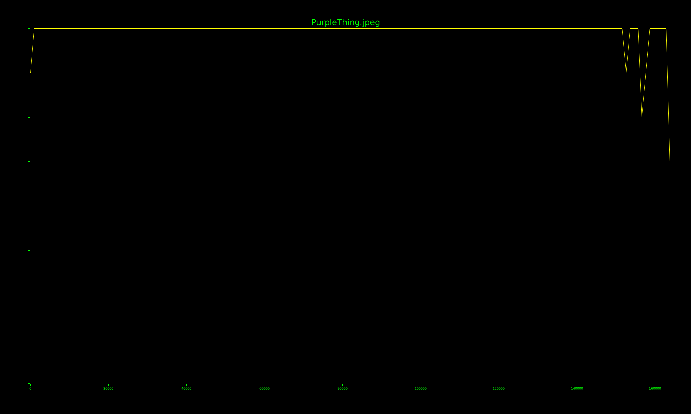

# Binwalk
### Walk that walk

---

Link to the CTFlearn challenge: [https://ctflearn.com/challenge/108](https://ctflearn.com/challenge/108)

**Task:**<br>You have an image file, located here: [https://mega.nz/#!qbpUTYiK!-deNdQJxsQS8bTSMxeUOtpEclCI-zpK7tbJiKV0tXYY](https://mega.nz/#!qbpUTYiK!-deNdQJxsQS8bTSMxeUOtpEclCI-zpK7tbJiKV0tXYY)<br>
Extract the answer from that!

---

### Where to look
Most of the time I start my "hidden image" investigations with steghide.<br>This time it says `the file format of the file "PurpleThing.jpeg" is not supported.`

So we won't go down this way. The task clearly states that we need to use binwalk. This is a classic type of a CTF. 

---

### What is binwalk
It's a common linux tool to analyse binary files and look for embedded stuff inside. Many people use it to extract contents of firmware images (like from routers or IoT devices)

> binwalk3 is a refreshed version of binwalk, rewritten in Rust (with enhanced support and capabilities)

---

### The fun behind binwalk
It's a tool I've dived into recently. Its job is to identify file system offsets, compression headers and architectural details to dissect firmware.

In binwalk3 you can for example:
- use special `-M` or `--matryoshka` flag that scans for files recursively; also, use it with `-v` to show all results in the scan
- log to a JSON file with `-l` or `--log` flag 
- use `-t <THREADS>` or `--threads <THREADS>` to manually specify the number of threads to use
- create your own signatures (for offset detections) by modifying `/etc/binwalk/magic` file
- check the entropy of a file; useful to check if a hidden payload contains something interesting



---

### Find that flag!
Binwalk tasks are straightforward. First, check if there is anything hidden in the given file:
```
$ binwalk3 PurpleThing.jpeg

-------------------------------------------------------------------
DECIMAL      HEXADECIMAL      DESCRIPTION
-------------------------------------------------------------------
0            0x0              PNG image, total size: 153493 bytes
153493       0x25795          PNG image, total size: 11309 bytes
-------------------------------------------------------------------
```

> Yes, there is a second image, hidden at offset 0x25795

Now, extract it!

```
$ binwalk3 -e PurpleThing.jpeg
```

You should see an `extractions` folder now. Go to `.\extractions\PurpleThing.jpeg.extracted\25795`, and the second image is right there. It contains the answer.

Final flag: `ABCTF{b1nw4lk_is_us3ful}`

---

### Sources
- [binwalk3 - Kali Linux Tools](https://www.kali.org/tools/binwalk3/)
- [Analysing and extracting firmware using Binwalk 3.1.0 in 2025](https://fr3ak-hacks.medium.com/analysing-and-extracting-firmware-using-binwalk-982012281ff6)
